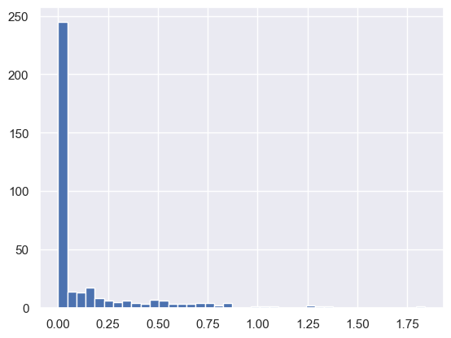
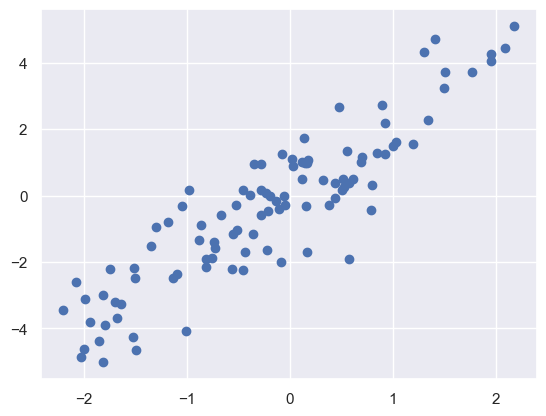
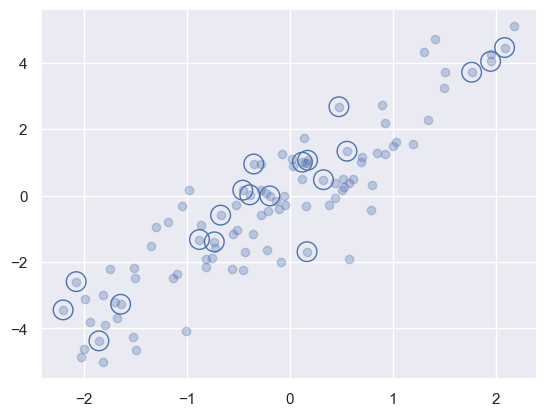
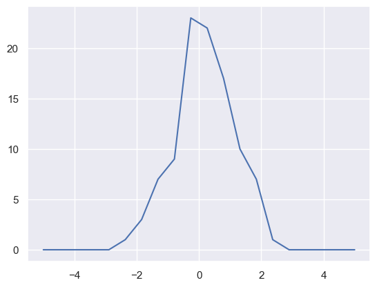
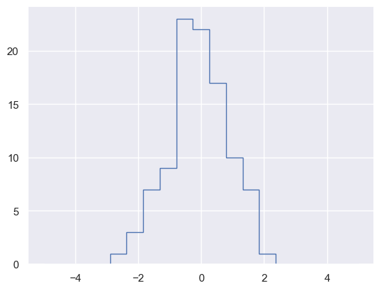

```python
import numpy 
numpy.__version__
```


    '1.23.5'


Ipython内置：?用于浏览文档


```python
numpy?
```

？？用于调出源代码


```python
numpy??
```

Python内置 help(func)用于获取文档


```python
L=[1,2,3]
L.insert(0,0)
```


```python
L
```


    [0, 1, 2, 3]


```python
L.insert?
```


```python
#对象本身的类型也适用
L?
```

# 创建数组

## 从Python列表创建数组


```python
import numpy as np
np.array([1,4,2,5,3])

```


    array([1, 4, 2, 5, 3])


```python
np.array([3.14,2,4,5])#类型不同时，会向上转化
```


    array([3.14, 2.  , 4.  , 5.  ])


```python
np.array([1,2,3,4],dtype='float32')
#指定元素类型
```


    array([1., 2., 3., 4.], dtype=float32)


```python
np.array([range(i,i+3) for i in [2,4,6]])#多维列表
```


    array([[2, 3, 4],
           [4, 5, 6],
           [6, 7, 8]])


## 从头创建数组


```python
np.zeros(10,dtype=int)

```


    array([0, 0, 0, 0, 0, 0, 0, 0, 0, 0])


```python
np.ones((3,5),dtype=float)
```


    array([[1., 1., 1., 1., 1.],
           [1., 1., 1., 1., 1.],
           [1., 1., 1., 1., 1.]])


```python
np.ones(3,dtype=float)
```


    array([1., 1., 1.])


```python
np.zeros((3,4),int)
```


    array([[0, 0, 0, 0],
           [0, 0, 0, 0],
           [0, 0, 0, 0]])


```python
#浮点数组，数值都是3.14
np.full((3,4),3.14)
```


    array([[3.14, 3.14, 3.14, 3.14],
           [3.14, 3.14, 3.14, 3.14],
           [3.14, 3.14, 3.14, 3.14]])


```python
#创建一个线性序列数组
np.arange(0,20,2)
```


    array([ 0,  2,  4,  6,  8, 10, 12, 14, 16, 18])


```python
#创建一个等差数列，范围0~1，个数：5个
np.linspace(0,1,5)
```


    array([0.  , 0.25, 0.5 , 0.75, 1.  ])


```python
#创建一个三乘三的，在0~1均匀分布的随机数组成的数组
np.random.random((3,3))
```


    array([[0.62023599, 0.51975592, 0.44511393],
           [0.38904316, 0.98449178, 0.09179685],
           [0.08917492, 0.19687482, 0.18941123]])


```python
#创建一个三乘三的，均值为0，标准差为1的正态分布组成的随机数组
np.random.normal(0,1,(3,3))#均值，标准差，size
```


    array([[ 0.14625293, -0.18281909, -2.0929842 ],
           [ 0.68439166,  0.38719333, -0.58125343],
           [ 1.26496284, -0.27715952,  1.54883672]])


```python
#创建一个3×3的，[0,10)区间的随机整型数组
np.random.randint(0,10,(3,3))
```


    array([[1, 0, 0],
           [2, 1, 9],
           [6, 1, 9]])


```python
#创建一个3×3的单位矩阵
np.eye(3)
```


    array([[1., 0., 0.],
           [0., 1., 0.],
           [0., 0., 1.]])


```python
#创建一个由3个整形组成的数组，值为任意元素
np.empty((2,3),dtype=int)
```


    array([[         0, 1072693248,          0],
           [1072693248,          0, 1072693248]])


```python
np.empty?
```

# Numpy数组基础


```python
np.random.seed(0)

x1=np.random.randint(10,size=6)#[0,10)区间的
x2=np.random.randint(10,size=(3,4))
```


```python
x1
```


    array([5, 0, 3, 3, 7, 9])


```python
x2
```


    array([[3, 5, 2, 4],
           [7, 6, 8, 8],
           [1, 6, 7, 7]])


```python
print('x2 dim:',x2.ndim)#几个维度
print('x2 shape:',x2.shape)#shape:几乘几
print('x2 size:',x2.size)#size：总元素个数
```

    x2 dim: 2
    x2 shape: (3, 4)
    x2 size 12
    


```python
x2.dtype
```


    dtype('int32')


```python
#数组切片
x=np.arange(10)
x
```


    array([0, 1, 2, 3, 4, 5, 6, 7, 8, 9])


```python
x[::2]#每隔一个元素
```


    array([0, 2, 4, 6, 8])


```python
x[::-1]#所有元素，逆序的
```


    array([9, 8, 7, 6, 5, 4, 3, 2, 1, 0])


```python
x[5::-2]
```


    array([5, 3, 1])


```python
x
```


    array([0, 1, 2, 3, 4, 5, 6, 7, 8, 9])


```python
x[0]=1
```


```python
x
```


    array([1, 1, 2, 3, 4, 5, 6, 7, 8, 9])


```python
#拷贝副本，不改变原x

x_sub=x[2:4].copy()
```


```python
x_sub[0:2]=[1,2]
```


```python
x_sub
```


    array([1, 2])


```python
x
```


    array([1, 1, 2, 3, 4, 5, 6, 7, 8, 9])


```python
#数组的变形
grid=np.arange(1,10).reshape((3,3))
grid
```


    array([[1, 2, 3],
           [4, 5, 6],
           [7, 8, 9]])


```python
#数组拼接+分裂
x=np.array([1,2,3])
y=np.array([3,2,1])
np.concatenate([x,y])
```


    array([1, 2, 3, 3, 2, 1])


```python
#二维数组
grid=np.array([[1,2,3],
               [4,5,6]])
np.concatenate([grid,grid])#默认外层轴拼接
```


    array([[1, 2, 3],
           [4, 5, 6],
           [1, 2, 3],
           [4, 5, 6]])


```python
np.concatenate([grid,grid],axis=1)#内层轴拼接
```


    array([[1, 2, 3, 1, 2, 3],
           [4, 5, 6, 4, 5, 6]])


```python
x=[1,2,3]
x**2#列表不支持这类数学运算
```


    ---------------------------------------------------------------------------

    TypeError                                 Traceback (most recent call last)

    Cell In[51], line 2
          1 x=[1,2,3]
    ----> 2 x**2
    

    TypeError: unsupported operand type(s) for ** or pow(): 'list' and 'int'


```python
import numpy as np
```


```python
np.array([1,2,3])**2
```


    array([1, 4, 9])


# Numpy通用函数

### 1、数组的运算： 标准加减乘除


```python
x=np.array([1,2,3])
x+x
```


    array([2, 4, 6])


```python
x-x
```


    array([0, 0, 0])


```python
x*2
```


    array([2, 4, 6])


```python
x/2
```


    array([0.5, 1. , 1.5])


```python
x//2
```


    array([0, 1, 1], dtype=int32)


```python
-x
```


    array([-1, -2, -3])


```python
abs(-x)
```


    array([1, 2, 3])


```python
#三角函数
x=np.linspace(0,np.pi,3)
x
```


    array([0.        , 1.57079633, 3.14159265])


```python
print('theta=',x)
print('sin(theta)=',np.sin(x))
```

    theta= [0.         1.57079633 3.14159265]
    sin(theta)= [0.0000000e+00 1.0000000e+00 1.2246468e-16]
    


```python
#指数运算
np.exp(x)
```


    array([ 1.        ,  4.81047738, 23.14069263])


```python
np.exp2(x)
```


    array([1.        , 2.97068642, 8.82497783])


```python
np.power(3,x)#3^x
```


    array([ 1.        ,  5.61642953, 31.5442807 ])


```python
x=[1,2,4,10]
np.log(x)
```


    array([0.        , 0.69314718, 1.38629436, 2.30258509])


```python
np.log2(x)
```


    array([0.        , 1.        , 2.        , 3.32192809])


```python
np.log10(x)
```


    array([0.        , 0.30103   , 0.60205999, 1.        ])


```python
#指定输出位置-有效节省内存
x=np.arange(5)
y=np.zeros(10)
np.power(2,x,out=y[::2])
```


    array([ 1.,  2.,  4.,  8., 16.])


```python
x=np.arange(1,6)
np.add.reduce(x)#规约运算，对给定操作重复执行
```


    15


```python
np.multiply.reduce(x)
```


    120


```python
#存储中间结果——accumulate
np.add.accumulate(x)
```


    array([ 1,  3,  6, 10, 15])


```python
#聚合运算
L=np.random.random(100)
L
```


    array([0.19718632, 0.3611736 , 0.54610753, 0.26944676, 0.51552422,
           0.19793311, 0.26071917, 0.2415178 , 0.53261096, 0.5346692 ,
           0.78321012, 0.51499114, 0.57524744, 0.40484984, 0.81407809,
           0.1029244 , 0.29543992, 0.85450326, 0.12673511, 0.95273868,
           0.97099175, 0.78840813, 0.73710319, 0.24532711, 0.25865787,
           0.19212016, 0.77221652, 0.91404196, 0.15304738, 0.22748449,
           0.45268969, 0.16961546, 0.76424821, 0.38471728, 0.61598972,
           0.81204699, 0.31504464, 0.48272614, 0.46537373, 0.55443772,
           0.67347998, 0.17503752, 0.3246986 , 0.37719638, 0.45432019,
           0.77741964, 0.61621433, 0.82137153, 0.30663442, 0.50000435,
           0.9998476 , 0.52242785, 0.82326828, 0.74721714, 0.93585802,
           0.09385823, 0.12912007, 0.73593788, 0.05221564, 0.21597463,
           0.86593577, 0.2569817 , 0.19643398, 0.75333874, 0.307371  ,
           0.37437904, 0.8211466 , 0.18857214, 0.99768861, 0.56740973,
           0.17144665, 0.31785572, 0.50611296, 0.6032949 , 0.44609345,
           0.29524553, 0.57627075, 0.65564266, 0.70618535, 0.00684272,
           0.78864581, 0.94935988, 0.80737556, 0.30842236, 0.2142743 ,
           0.65264531, 0.91299945, 0.20606068, 0.50415984, 0.76960093,
           0.27108717, 0.61462371, 0.62144922, 0.5701326 , 0.49010018,
           0.428047  , 0.69471275, 0.64695272, 0.01397536, 0.44922494])


```python
np.sum(L)
```


    50.16809485216821


```python
np.min(L)
```


    0.006842718911670764


```python
np.max(L)
```


    0.9998476031681872


```python
M=np.random.random((3,4))
print(M)
```

    [[0.15077699 0.26003384 0.19096022 0.91687894]
     [0.19729563 0.84658462 0.60108021 0.00687493]
     [0.07149357 0.4014261  0.21353555 0.88553962]]
    


```python
M.min(axis=0)#找到每一列最小值
```


    array([0.07149357, 0.26003384, 0.19096022, 0.00687493])


```python
M.max(axis=1)#找到每一行最大值
```


    array([0.91687894, 0.84658462, 0.88553962])


```python
np.percentile(L,25)
```


    0.26726486051055376


```python
np.median(L)
```


    0.5051364006775974


```python
#广播的实际应用
X=np.random.random((10,3))
Xmean=X.mean(axis=0)#沿着第一个维度--列聚合
X_centered=X-Xmean
```


```python
X_centered.mean(0)
```


    array([ 5.55111512e-17, -5.55111512e-17,  1.66533454e-17])


```python
print(np.newaxis)
```

    None
    

# 比较、掩码和布尔逻辑


```python
import pandas as pd

rainfall=pd.read_csv('data/Seattle2014.csv')

```


```python
rainfall
```


<div>
<style scoped>
    .dataframe tbody tr th:only-of-type {
        vertical-align: middle;
    }

    .dataframe tbody tr th {
        vertical-align: top;
    }

    .dataframe thead th {
        text-align: right;
    }
</style>
<table border="1" class="dataframe">
  <thead>
    <tr style="text-align: right;">
      <th></th>
      <th>STATION</th>
      <th>STATION_NAME</th>
      <th>DATE</th>
      <th>PRCP</th>
      <th>SNWD</th>
      <th>SNOW</th>
      <th>TMAX</th>
      <th>TMIN</th>
      <th>AWND</th>
      <th>WDF2</th>
      <th>WDF5</th>
      <th>WSF2</th>
      <th>WSF5</th>
      <th>WT01</th>
      <th>WT05</th>
      <th>WT02</th>
      <th>WT03</th>
    </tr>
  </thead>
  <tbody>
    <tr>
      <th>0</th>
      <td>GHCND:USW00024233</td>
      <td>SEATTLE TACOMA INTERNATIONAL AIRPORT WA US</td>
      <td>20140101</td>
      <td>0</td>
      <td>0</td>
      <td>0</td>
      <td>72</td>
      <td>33</td>
      <td>12</td>
      <td>340</td>
      <td>310</td>
      <td>36</td>
      <td>40</td>
      <td>-9999</td>
      <td>-9999</td>
      <td>-9999</td>
      <td>-9999</td>
    </tr>
    <tr>
      <th>1</th>
      <td>GHCND:USW00024233</td>
      <td>SEATTLE TACOMA INTERNATIONAL AIRPORT WA US</td>
      <td>20140102</td>
      <td>41</td>
      <td>0</td>
      <td>0</td>
      <td>106</td>
      <td>61</td>
      <td>32</td>
      <td>190</td>
      <td>200</td>
      <td>94</td>
      <td>116</td>
      <td>-9999</td>
      <td>-9999</td>
      <td>-9999</td>
      <td>-9999</td>
    </tr>
    <tr>
      <th>2</th>
      <td>GHCND:USW00024233</td>
      <td>SEATTLE TACOMA INTERNATIONAL AIRPORT WA US</td>
      <td>20140103</td>
      <td>15</td>
      <td>0</td>
      <td>0</td>
      <td>89</td>
      <td>28</td>
      <td>26</td>
      <td>30</td>
      <td>50</td>
      <td>63</td>
      <td>72</td>
      <td>1</td>
      <td>-9999</td>
      <td>-9999</td>
      <td>-9999</td>
    </tr>
    <tr>
      <th>3</th>
      <td>GHCND:USW00024233</td>
      <td>SEATTLE TACOMA INTERNATIONAL AIRPORT WA US</td>
      <td>20140104</td>
      <td>0</td>
      <td>0</td>
      <td>0</td>
      <td>78</td>
      <td>6</td>
      <td>27</td>
      <td>40</td>
      <td>40</td>
      <td>45</td>
      <td>58</td>
      <td>1</td>
      <td>-9999</td>
      <td>-9999</td>
      <td>-9999</td>
    </tr>
    <tr>
      <th>4</th>
      <td>GHCND:USW00024233</td>
      <td>SEATTLE TACOMA INTERNATIONAL AIRPORT WA US</td>
      <td>20140105</td>
      <td>0</td>
      <td>0</td>
      <td>0</td>
      <td>83</td>
      <td>-5</td>
      <td>37</td>
      <td>10</td>
      <td>10</td>
      <td>67</td>
      <td>76</td>
      <td>-9999</td>
      <td>-9999</td>
      <td>-9999</td>
      <td>-9999</td>
    </tr>
    <tr>
      <th>...</th>
      <td>...</td>
      <td>...</td>
      <td>...</td>
      <td>...</td>
      <td>...</td>
      <td>...</td>
      <td>...</td>
      <td>...</td>
      <td>...</td>
      <td>...</td>
      <td>...</td>
      <td>...</td>
      <td>...</td>
      <td>...</td>
      <td>...</td>
      <td>...</td>
      <td>...</td>
    </tr>
    <tr>
      <th>360</th>
      <td>GHCND:USW00024233</td>
      <td>SEATTLE TACOMA INTERNATIONAL AIRPORT WA US</td>
      <td>20141227</td>
      <td>33</td>
      <td>0</td>
      <td>0</td>
      <td>94</td>
      <td>44</td>
      <td>49</td>
      <td>210</td>
      <td>210</td>
      <td>112</td>
      <td>161</td>
      <td>1</td>
      <td>-9999</td>
      <td>-9999</td>
      <td>-9999</td>
    </tr>
    <tr>
      <th>361</th>
      <td>GHCND:USW00024233</td>
      <td>SEATTLE TACOMA INTERNATIONAL AIRPORT WA US</td>
      <td>20141228</td>
      <td>41</td>
      <td>0</td>
      <td>0</td>
      <td>67</td>
      <td>28</td>
      <td>18</td>
      <td>50</td>
      <td>30</td>
      <td>58</td>
      <td>72</td>
      <td>1</td>
      <td>-9999</td>
      <td>-9999</td>
      <td>-9999</td>
    </tr>
    <tr>
      <th>362</th>
      <td>GHCND:USW00024233</td>
      <td>SEATTLE TACOMA INTERNATIONAL AIRPORT WA US</td>
      <td>20141229</td>
      <td>0</td>
      <td>0</td>
      <td>0</td>
      <td>61</td>
      <td>6</td>
      <td>43</td>
      <td>350</td>
      <td>350</td>
      <td>76</td>
      <td>103</td>
      <td>1</td>
      <td>-9999</td>
      <td>-9999</td>
      <td>-9999</td>
    </tr>
    <tr>
      <th>363</th>
      <td>GHCND:USW00024233</td>
      <td>SEATTLE TACOMA INTERNATIONAL AIRPORT WA US</td>
      <td>20141230</td>
      <td>0</td>
      <td>0</td>
      <td>0</td>
      <td>33</td>
      <td>-21</td>
      <td>36</td>
      <td>90</td>
      <td>70</td>
      <td>63</td>
      <td>76</td>
      <td>-9999</td>
      <td>-9999</td>
      <td>-9999</td>
      <td>-9999</td>
    </tr>
    <tr>
      <th>364</th>
      <td>GHCND:USW00024233</td>
      <td>SEATTLE TACOMA INTERNATIONAL AIRPORT WA US</td>
      <td>20141231</td>
      <td>0</td>
      <td>0</td>
      <td>0</td>
      <td>33</td>
      <td>-27</td>
      <td>30</td>
      <td>30</td>
      <td>-9999</td>
      <td>58</td>
      <td>-9999</td>
      <td>-9999</td>
      <td>-9999</td>
      <td>-9999</td>
      <td>-9999</td>
    </tr>
  </tbody>
</table>
<p>365 rows × 17 columns</p>
</div>


```python
rainfall['PRCP']
```


    0       0
    1      41
    2      15
    3       0
    4       0
           ..
    360    33
    361    41
    362     0
    363     0
    364     0
    Name: PRCP, Length: 365, dtype: int64


```python
rainfall['PRCP'].values
```


    array([  0,  41,  15,   0,   0,   3, 122,  97,  58,  43, 213,  15,   0,
             0,   0,   0,   0,   0,   0,   0,   0,   5,   0,   0,   0,   0,
             0,  89, 216,   0,  23,  20,   0,   0,   0,   0,   0,   0,  51,
             5, 183, 170,  46,  18,  94, 117, 264, 145, 152,  10,  30,  28,
            25,  61, 130,   3,   0,   0,   0,   5, 191, 107, 165, 467,  30,
             0, 323,  43, 188,   0,   0,   5,  69,  81, 277,   3,   0,   5,
             0,   0,   0,   0,   0,  41,  36,   3, 221, 140,   0,   0,   0,
             0,  25,   0,  46,   0,   0,  46,   0,   0,   0,   0,   0,   0,
             5, 109, 185,   0, 137,   0,  51, 142,  89, 124,   0,  33,  69,
             0,   0,   0,   0,   0, 333, 160,  51,   0,   0, 137,  20,   5,
             0,   0,   0,   0,   0,   0,   0,   0,   0,   0,   0,   0,  38,
             0,  56,   0,   0,   0,   0,   0,   0,   0,   0,   0,   0,   0,
             0,   0,   0,   0,   0,   0,  18,  64,   0,   5,  36,  13,   0,
             8,   3,   0,   0,   0,   0,   0,   0,  18,  23,   0,   0,   0,
             0,   0,   0,   0,   0,   0,   0,   0,   0,   0,   0,   0,   0,
             0,   0,   0,   0,   0,   0,   0,   3, 193,   0,   0,   0,   0,
             0,   0,   0,   0,   0,   5,   0,   0,   0,   0,   0,   0,   0,
             0,   5, 127, 216,   0,  10,   0,   0,   0,   0,   0,   0,   0,
             0,   0,   0,   0,   0,   0,   0,  84,  13,   0,  30,   0,   0,
             0,   0,   0,   0,   0,   0,   0,   0,   0,   0,   0,   0,   5,
             3,   0,   0,   0,   3, 183, 203,  43,  89,   0,   0,   8,   0,
             0,   0,   0,   0,   0,   0,   0,   0,   0,   3,  74,   0,  76,
            71,  86,   0,  33, 150,   0, 117,  10, 320,  94,  41,  61,  15,
             8, 127,   5, 254, 170,   0,  18, 109,  41,  48,  41,   0,   0,
            51,   0,   0,   0,   0,   0,   0,   0,   0,   0,   0,  36, 152,
             5, 119,  13, 183,   3,  33, 343,  36,   0,   0,   0,   0,   8,
            30,  74,   0,  91,  99, 130,  69,   0,   0,   0,   0,   0,  28,
           130,  30, 196,   0,   0, 206,  53,   0,   0,  33,  41,   0,   0,
             0], dtype=int64)


```python
rainfall2=rainfall['PRCP'].values
```


```python
inches=rainfall2/254
```


```python
inches.shape#365天每天的降水量，单位英寸
```


    (365,)


```python
%matplotlib inline#将matplotlib生成的图形嵌入到Notebook的输出单元中
import matplotlib.pyplot as plt
import seaborn;seaborn.set()#设置绘图风格
```


```python
plt.hist(inches,40)#柱子数：40，直方图
```


    (array([245.,  14.,  13.,  17.,   8.,   6.,   5.,   6.,   4.,   3.,   7.,
              6.,   3.,   3.,   3.,   4.,   4.,   2.,   4.,   0.,   0.,   1.,
              1.,   1.,   0.,   0.,   0.,   2.,   1.,   1.,   0.,   0.,   0.,
              0.,   0.,   0.,   0.,   0.,   0.,   1.]),
     array([0.        , 0.04596457, 0.09192913, 0.1378937 , 0.18385827,
            0.22982283, 0.2757874 , 0.32175197, 0.36771654, 0.4136811 ,
            0.45964567, 0.50561024, 0.5515748 , 0.59753937, 0.64350394,
            0.6894685 , 0.73543307, 0.78139764, 0.8273622 , 0.87332677,
            0.91929134, 0.96525591, 1.01122047, 1.05718504, 1.10314961,
            1.14911417, 1.19507874, 1.24104331, 1.28700787, 1.33297244,
            1.37893701, 1.42490157, 1.47086614, 1.51683071, 1.56279528,
            1.60875984, 1.65472441, 1.70068898, 1.74665354, 1.79261811,
            1.83858268]),
     <BarContainer object of 40 artists>)


    

    


```python
import numpy as np
rng=np.random.RandomState(0)#随机数种子
x=rng.randint(10,size=(3,4))
x
```


    array([[5, 0, 3, 3],
           [7, 9, 3, 5],
           [2, 4, 7, 6]])


```python
x<6
```


    array([[ True,  True,  True,  True],
           [False, False,  True,  True],
           [ True,  True, False, False]])


```python
#有多少值小于6
np.count_nonzero(x<6)
```


    8


```python
np.sum(x<6)
```


    8


```python
np.sum(x<6,axis=1)#每行有多少值小于6
```


    array([4, 2, 2])


```python
np.any(x>8)#有没有大于8的
```


    True


```python
np.all(x<10)#是否所有都小于10
```


    True


```python
np.sum((inches>0.5)&(inches<1))
```


    29


```python
np.sum(~((inches<=0.5)|(inches>=1)))
```


    29


```python
np.sum(inches==0)#没雨的天气
```


    215


```python
np.sum(inches!=0)
```


    150


```python
np.sum(inches>0.5)
```


    37


```python
#掩码操作
x
```


    array([[5, 0, 3, 3],
           [7, 9, 3, 5],
           [2, 4, 7, 6]])


```python
x[x<5]#将满足括号中条件的值从数组中取出
```


    array([0, 3, 3, 3, 2, 4])


```python
#生成二维数组
import numpy as np

mean = [0, 0]
cov = [[1, 2],
       [2, 5]]

# 使用 np.random.multivariate_normal 生成多元正态分布随机数
X = np.random.multivariate_normal(mean, cov, 100)
print(X.shape)  # 输出 (100, 2)
```

    (100, 2)
    


```python
%matplotlib inline
plt.scatter(X[:,0],X[:,1])
```


    <matplotlib.collections.PathCollection at 0x20e362f0fa0>


    

    


```python
indices=np.random.choice(X.shape[0],20,replace=False)
indices
```


    array([95, 42, 34, 86, 77, 61, 69, 18, 19, 23,  2, 21, 14, 89, 29, 97, 90,
            5,  7, 36])


```python
selection=X[indices]
selection.shape
```


    (20, 2)


```python
plt.scatter(X[:,0],X[:,1],alpha=0.3)
plt.scatter(selection[:,0],selection[:,1],facecolor='none',edgecolor='b',s=200)
```


    <matplotlib.collections.PathCollection at 0x20e3630bf70>


    

    


```python
#用花哨的索引修改值
x=np.arange(10)
i=np.array([2,1,8,4])
x[i]=99
print(x)
```

    [ 0 99 99  3 99  5  6  7 99  9]
    


```python
#不同位置加不同的值
x=np.zeros(10)
i=[2,3,3,4,4,4]
np.add.at(x,i,1)#在i的索引处加1
print(x)
```

    [0. 0. 1. 2. 3. 0. 0. 0. 0. 0.]
    

## 手动计算直方图


```python
np.random.seed(42)
x=np.random.randn(100)

```


```python
bins=np.linspace(-5,5,20)
counts=np.zeros_like(bins)#生成20维的0
counts
```


    array([0., 0., 0., 0., 0., 0., 0., 0., 0., 0., 0., 0., 0., 0., 0., 0., 0.,
           0., 0., 0.])


```python
#为每个x找到合适的区间
i=np.searchsorted(bins,x)
i#每个x对应属于第几个bins已经附在了i里
```


    array([11, 10, 11, 13, 10, 10, 13, 11,  9, 11,  9,  9, 10,  6,  7,  9,  8,
           11,  8,  7, 13, 10, 10,  7,  9, 10,  8, 11,  9,  9,  9, 14, 10,  8,
           12,  8, 10,  6,  7, 10, 11, 10, 10,  9,  7,  9,  9, 12, 11,  7, 11,
            9,  9, 11, 12, 12,  8,  9, 11, 12,  9, 10,  8,  8, 12, 13, 10, 12,
           11,  9, 11, 13, 10, 13,  5, 12, 10,  9, 10,  6, 10, 11, 13,  9,  8,
            9, 12, 11,  9, 11, 10, 12,  9,  9,  9,  7, 11, 10, 10, 10],
          dtype=int64)


```python
np.add.at(counts,i,1)#统计每个区间元素个数
```


```python
plt.plot(bins,counts,linestyle='solid')
```


    [<matplotlib.lines.Line2D at 0x20e3a9d7910>]


    

    


```python
plt.hist(x,bins,histtype='step')
```


    (array([ 0.,  0.,  0.,  0.,  1.,  3.,  7.,  9., 23., 22., 17., 10.,  7.,
             1.,  0.,  0.,  0.,  0.,  0.]),
     array([-5.        , -4.47368421, -3.94736842, -3.42105263, -2.89473684,
            -2.36842105, -1.84210526, -1.31578947, -0.78947368, -0.26315789,
             0.26315789,  0.78947368,  1.31578947,  1.84210526,  2.36842105,
             2.89473684,  3.42105263,  3.94736842,  4.47368421,  5.        ]),
     [<matplotlib.patches.Polygon at 0x20e3b425600>])


    

    


```python
#np.sort 快速排序， O(NlogN)
x=np.array([2,1,4,3,5])
np.sort(x)
```


    array([1, 2, 3, 4, 5])


```python
#用排序好的数组替代原始数组
x.sort()
print(x)
```

    [1 2 3 4 5]
    


```python
#返回原始数组排好序的索引值
x=np.array([2,1,4,3,5])
i=np.argsort(x)
print(i)
```

    [1 0 3 2 4]
    


```python
x[i]
```


    array([1, 2, 3, 4, 5])


```python
#沿着行\列排序
rand=np.random.RandomState(42)
X=rand.randint(0,10,(4,6))
print(X)
```

    [[6 3 7 4 6 9]
     [2 6 7 4 3 7]
     [7 2 5 4 1 7]
     [5 1 4 0 9 5]]
    


```python
np.sort(X,axis=0)#对X的每一列排序
```


    array([[2, 1, 4, 0, 1, 5],
           [5, 2, 5, 4, 3, 7],
           [6, 3, 7, 4, 6, 7],
           [7, 6, 7, 4, 9, 9]])


```python
#部分排序，分割--第k小
x=np.array([7,2,3,1,6,5,4])
np.partition(x,3)
#数组中前三个值为数组中最小的三个值
```


    array([2, 1, 3, 4, 6, 5, 7])


```python
#如果每天都需要使用结构化数组，直接用Pandas包是更好的选择
```
